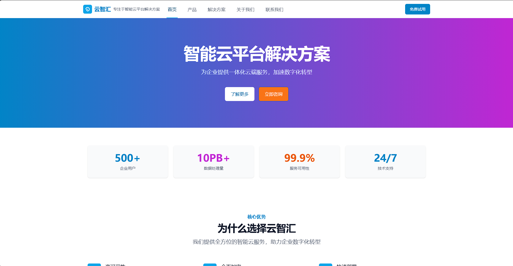
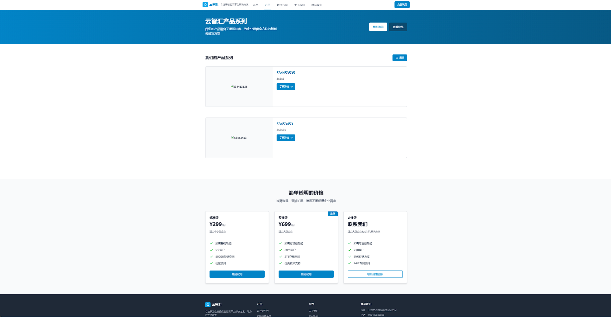
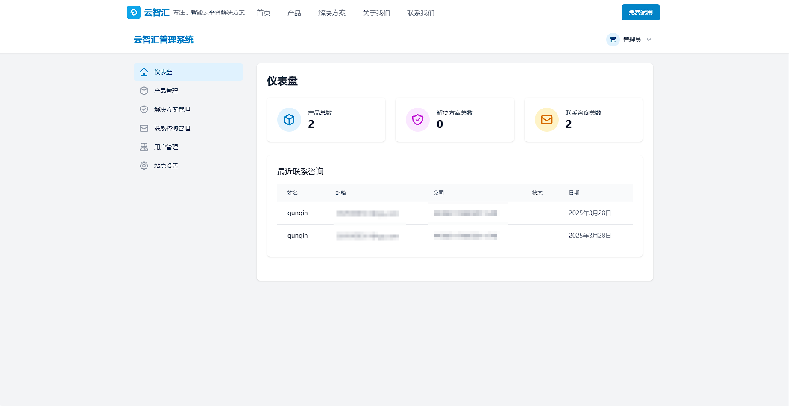

# 云智汇CMS - 企业级智能云平台解决方案官网

这是一个使用Vue 3、TailwindCSS和Vite开发的完整产品官网，包含前端展示系统和后端管理系统，支持丰富的动态内容管理功能。

> **注意：** 当前项目仍处于开发阶段，是一个半成品。以下展示的功能和界面部分已实现，部分仍在开发中。

## 当前开发进度

- [x] 前端基础框架搭建
- [x] 首页基本布局与样式
- [x] 产品展示页面基本功能
- [x] 后台管理界面基础框架
- [ ] 完整的数据库模型实现
- [ ] 用户权限管理系统完善
- [ ] 动态内容管理全部功能
- [ ] 移动端适配优化
- [ ] 性能优化与代码重构
- [ ] 自动化测试

我们计划在2025年6月前完成所有功能的开发和测试。欢迎贡献代码或提出建议，帮助我们更快地完成这个项目。

## 系统预览

### 首页展示

*云智汇官网首页 - 响应式设计，完美适配各种设备*

## 项目特点

- **前端展示系统**：基于Vue 3 + TailwindCSS + Vite构建的响应式产品官网
- **后端API服务**：Node.js + Express + MySQL构建的完整API服务
- **动态内容管理**：所有前端内容均可通过后台动态配置与更新
- **完整的后台管理**：产品管理、解决方案管理、客户咨询和系统设置
- **响应式设计**：完美适配PC端和移动端
- **Docker支持**：支持Docker部署，简化环境配置和部署流程

## 技术栈详解

### 前端技术栈
- **框架**: Vue 3 (使用组合式API)
- **路由**: Vue Router 4
- **HTTP客户端**: Axios
- **CSS框架**: TailwindCSS
- **构建工具**: Vite
- **UI组件**: 自定义组件库
- **拖拽功能**: vuedraggable

### 后端技术栈
- **服务器**: Node.js + Express
- **数据库**: MySQL 
- **ORM**: Sequelize
- **认证**: JWT (JSON Web Token)
- **中间件**: cors, morgan, express.json等
- **密码加密**: bcryptjs

## 代码结构详解

### 前端代码详解

#### 产品展示

*产品详情展示页面 - 展示产品特点和核心功能*

#### 组件系统

**公共组件 (`src/components/`)**
- `Navbar.vue` - 响应式导航栏组件
- `Footer.vue` - 全站页脚组件
- `ProductCard.vue` - 产品卡片组件
- `SolutionCard.vue` - 解决方案卡片组件
- `Testimonial.vue` - 客户评价组件
- `PricingTable.vue` - 价格表组件
- `StatItem.vue` - 数据统计项组件
- `Breadcrumb.vue` - 面包屑导航组件

**管理端组件 (`src/components/admin/`)**
- `Sidebar.vue` - 管理后台侧边栏组件 
- `DataTable.vue` - 数据表格组件
- `JsonSettingEditor.vue` - JSON格式设置编辑器组件，支持复杂结构化数据
- `RichTextEditor.vue` - 富文本编辑器组件
- `FileUploader.vue` - 文件上传组件
- `Pagination.vue` - 分页组件

#### 页面结构

**前台页面 (`src/views/`)**
- `Home.vue` - 首页，展示产品概览、特色功能、客户评价等
- `About.vue` - 关于我们页面，展示公司介绍、团队成员、公司历史
- `Contact.vue` - 联系我们页面，包含联系表单和联系信息
- `Products.vue` - 产品列表页面
- `ProductDetail.vue` - 产品详情页面
- `Solutions.vue` - 解决方案列表页面
- `SolutionDetail.vue` - 解决方案详情页面

**后台页面 (`src/views/admin/`)**
- `Dashboard.vue` - 管理后台首页，展示统计数据和快捷入口
- `Login.vue` - 管理员登录页面
- `Products.vue` - 产品管理页面
- `Solutions.vue` - 解决方案管理页面
- `Contacts.vue` - 客户咨询管理页面
- `Users.vue` - 用户管理页面
- `Settings.vue` - 系统设置页面，包含全站设置管理
- `Profile.vue` - 个人资料管理页面

#### API调用 (`src/api/`)

- `index.js` - API服务声明与Axios配置
  - `productApi` - 产品管理相关API
  - `solutionApi` - 解决方案管理相关API
  - `contactApi` - 客户咨询管理相关API
  - `authApi` - 认证相关API
  - `userApi` - 用户管理相关API
  - `settingService` - 系统设置相关API

### 后端代码详解

#### 后台管理界面

*云智汇后台管理系统 - 提供完整的内容管理功能*

#### 控制器 (`server/controllers/`)

- `productController.js` - 产品管理控制器
  - 获取产品列表、单个产品
  - 创建、更新、删除产品

- `solutionController.js` - 解决方案管理控制器
  - 获取解决方案列表、单个解决方案
  - 按行业获取解决方案
  - 创建、更新、删除解决方案

- `contactController.js` - 客户咨询管理控制器
  - 提交咨询
  - 获取咨询列表、单个咨询
  - 更新咨询状态

- `authController.js` - 认证控制器
  - 用户登录
  - 获取当前用户信息
  - 用户注册
  - 更新用户信息和密码

- `userController.js` - 用户管理控制器
  - 获取用户列表、单个用户
  - 创建、更新、删除用户
  - 重置用户密码

- `settingController.js` - 系统设置控制器
  - 获取设置列表、单个设置
  - 更新设置
  - 批量更新设置

#### 数据模型 (`server/models/`)

- `Product.js` - 产品数据模型
- `Solution.js` - 解决方案数据模型
- `Contact.js` - 客户咨询数据模型
- `User.js` - 用户数据模型
- `Setting.js` - 系统设置数据模型

#### 路由 (`server/routes/`)

- `productRoutes.js` - 产品相关路由
- `solutionRoutes.js` - 解决方案相关路由
- `contactRoutes.js` - 客户咨询相关路由
- `authRoutes.js` - 认证相关路由
- `userRoutes.js` - 用户管理相关路由
- `settingRoutes.js` - 系统设置相关路由

#### 中间件 (`server/middleware/`)

- `auth.js` - 认证中间件
  - `protect` - 验证用户是否已登录
  - `authorize` - 验证用户权限

## 核心功能详解

### 动态内容管理

系统实现了全站内容的动态管理功能，包括：

1. **首页内容管理**：
   - 英雄区标题、副标题
   - 产品特色展示区
   - 客户评价
   - 数据统计指标

2. **关于我们页面**：
   - 公司简介
   - 企业文化与价值观
   - 公司发展历程
   - 团队成员介绍

3. **联系我们页面**：
   - 联系方式（电话、邮箱、地址）
   - 联系表单选项

所有内容均采用结构化JSON数据存储，通过`JsonSettingEditor.vue`组件提供友好的编辑界面，支持复杂数据的编辑，如多层次对象、数组等。

### 权限控制

系统实现了基于角色的权限控制：
- **游客**：可以浏览前台页面，提交咨询表单
- **管理员**：可以访问后台管理系统，管理所有内容

### 表单验证与提交

- 前端使用Vue的响应式系统实现表单验证
- 提交表单时进行多项验证（必填项、格式等）
- 支持文件上传功能（如产品图片）

## 如何贡献

如果您想为本项目做出贡献，可以：

1. Fork本仓库
2. 创建您的功能分支 (`git checkout -b feature/amazing-feature`)
3. 提交您的更改 (`git commit -m 'Add some amazing feature'`)
4. 推送到分支 (`git push origin feature/amazing-feature`)
5. 打开一个Pull Request

## 项目开发状态与待完成功能

> **重要说明：** 本项目目前仍处于开发阶段，是一个半成品。以下列出的许多功能仅为计划实现的功能，部分界面和功能展示仅为原型设计。

由于项目仍处于开发阶段，以下是我们计划在未来版本中实现和完善的功能：

### 前端功能
- **多语言支持**：添加中英文切换功能，支持国际化
- **主题切换**：实现明暗主题切换，提升用户体验
- **性能优化**：
  - 实现组件懒加载
  - 添加图片懒加载功能
  - 优化大型JSON数据的渲染性能
  - 代码分割与按需加载
- **更多交互动画**：添加页面过渡效果和微交互动画

### 后端功能
- **完善数据库模型**：优化数据结构，增强数据关联
- **缓存系统**：实现Redis缓存，提升API响应速度
- **文件存储优化**：支持云存储集成（阿里云OSS、腾讯云COS等）
- **API限流与安全**：实现请求限流、CSRF防护等安全措施

### 管理系统
- **数据可视化**：添加数据统计图表，提供业务洞察
- **批量操作**：
  - 支持数据批量导入导出
  - 添加数据导出功能（Excel、CSV等格式）
- **操作日志**：记录管理员操作，支持审计追踪
- **自定义角色**：细粒度的权限控制系统

### 部署与运维
- **CI/CD流程**：完善自动化测试和部署流程
- **监控系统**：集成应用监控和报警功能
- **备份恢复**：自动化数据备份和恢复机制

## 已解决问题

1. **设置更新不显示在前端**：现已通过SSE事件推送实时通知前端，修改设置后页面会自动刷新数据。
2. **API请求超时**：所有列表接口已支持分页查询，大数据量请求不再阻塞。
3. **图片上传失败**：新增文件上传接口和前端压缩组件，上传大图片时将自动压缩并成功上传。

## 许可证

本项目采用 MIT 许可证 - 查看 [LICENSE](LICENSE) 文件了解详情
